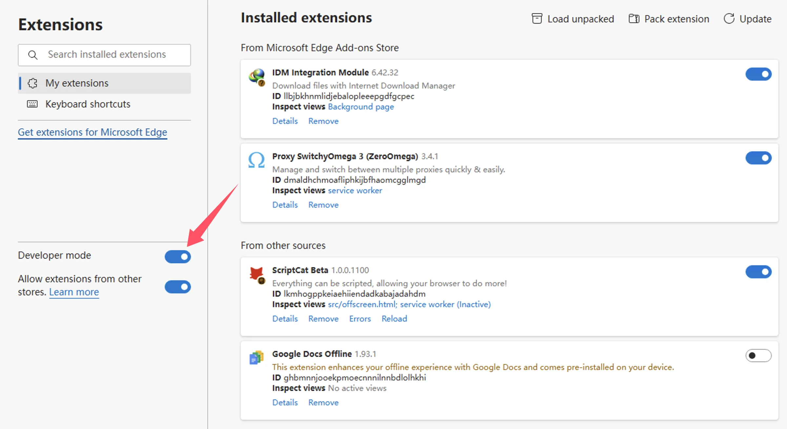
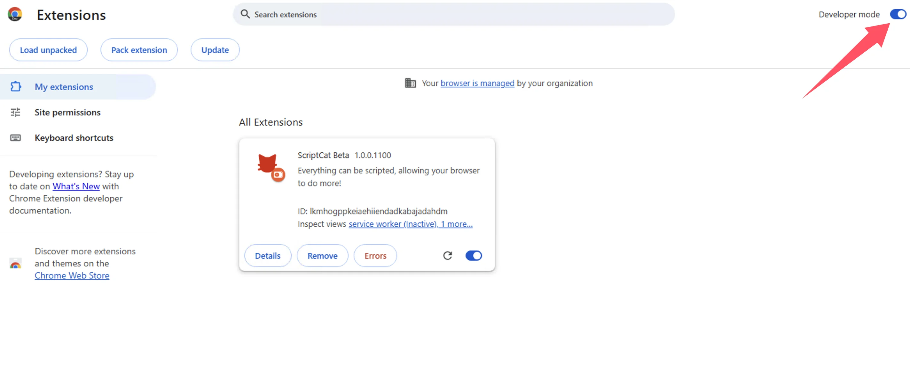
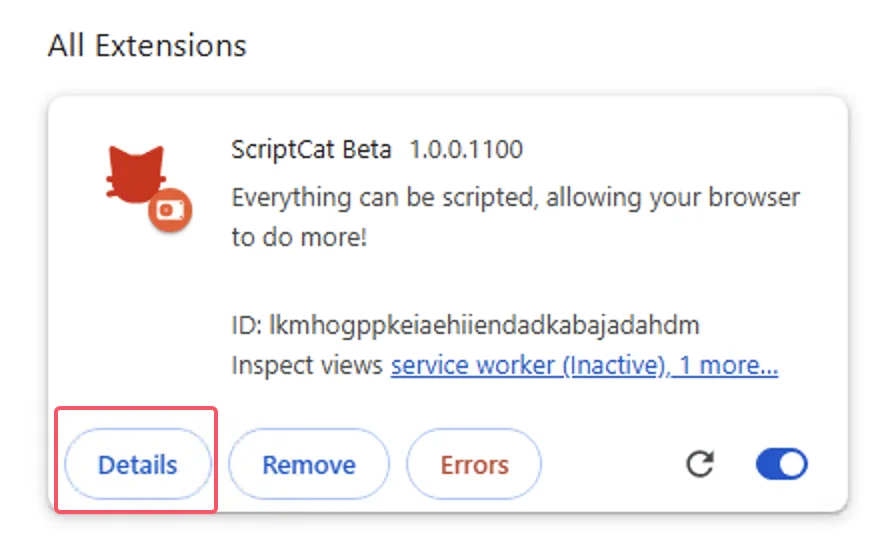
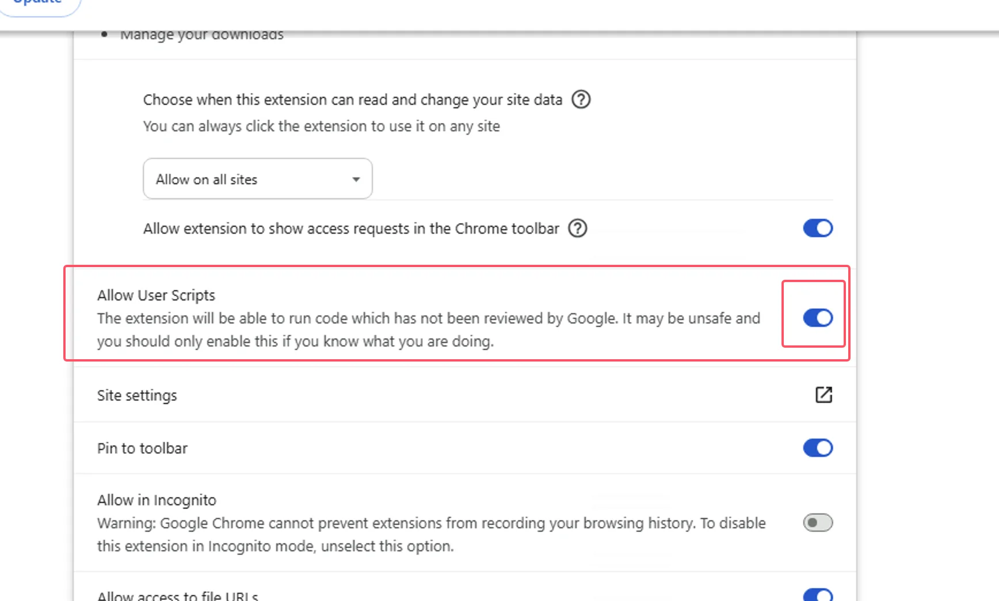

# Enable Browser User Scripts Support

Due to browser restrictions, extensions are forced to upgrade to Manifest V3, and Manifest V2 extensions will be completely discontinued after June 2025;

Under the limitations of Manifest V3, you must enable developer mode/user scripts functionality to use ScriptCat extension normally.

Reference: [Developer mode for extension users](https://developer.chrome.com/docs/extensions/reference/api/userScripts?hl=en#developer_mode_for_extension_users), [Manifest V3](https://developer.chrome.com/docs/extensions/develop/migrate/what-is-mv3?hl=en)

⚠️⚠️⚠️ For browser kernel versions >=138, you need to enable [Allow User Scripts](#allow-user-scripts). For lower versions \<138, use [Enable Developer Mode](#enable-developer-mode).

⚠️⚠️⚠️ Please note: If you are using Windows 8/7/XP systems, or browser kernel versions lower than \<120, you need to manually install the [legacy ScriptCat](https://github.com/scriptscat/scriptcat/releases). v0.16.x is the last version that supports Manifest V2. Installation steps can be found at: [Load unpacked extension installation](/docs/use/use/#load-unpacked-extension-installation).

## Enable Developer Mode

① Open the browser's extension management interface, or visit [chrome://extensions/](chrome://extensions/)

- 1. **Edge**

  

- 2. **Chrome**

  

② Enable `Developer mode` (In some browsers, this mode may be located in other options, such as 360 Browser: Advanced Management > Developer Mode)

- 1. **Edge** 
  
  
- 2. **Chrome** 

  

③ After enabling developer mode, disable and then re-enable the extension, or restart the browser to make the script functionality effective.

## Allow User Scripts

[Allow User Scripts](https://developer.chrome.com/docs/extensions/reference/api/userScripts?hl=en#chrome_versions_138_and_newer_allow_user_scripts_toggle) is a new feature of Manifest V3 that allows user scripts to run in the browser.

① Open the browser's extension management interface, or visit [chrome://extensions/](chrome://extensions/)

- 1. **Edge**

  

- 2. **Chrome**

  

② In the extension management interface, find the ScriptCat extension and click `Details`

③ In the ScriptCat extension details page, find the `Allow user scripts` option and enable it. Then disable and re-enable the extension, or restart the browser to make the script functionality effective.

> ⚠️⚠️⚠️ If you are using Edge browser (>=138 version) and don't see the `Allow user scripts` option, or still see errors after enabling developer mode, please refer to: [Edge browser not showing Allow user scripts option](https://github.com/scriptscat/scriptcat/issues/418#issuecomment-2994772406)

